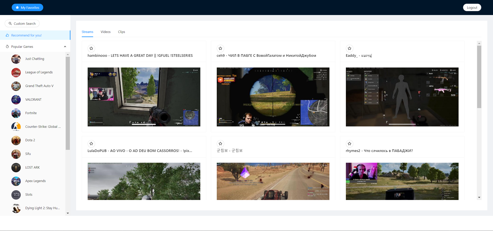
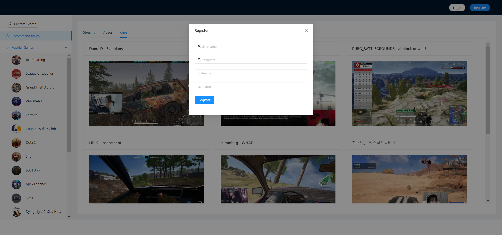

# A Personalized Twitch Resources Recommendation Engine

## Tools
 *ReactJS  *Spring  *AWS EC2/RDS  *RESTful API  *MySQL    

## User Interface

## Description

* Designed and built a full-stack web application for users to search twitch resources (stream/video/clip) and get recommendations.
* Built a web page with rich + user friendly experience using React and Ant Design. 
* Implemented RESTful APIs using Java servlets, retrieved real Twitch resources using Twitch API and stored data in MySQL.
* Explored multiple recommendation algorithms and extracted game information from Twitch resources to implement a Content-based algorithm. 
* Deployed the service to AWS EC2 for better stability.

